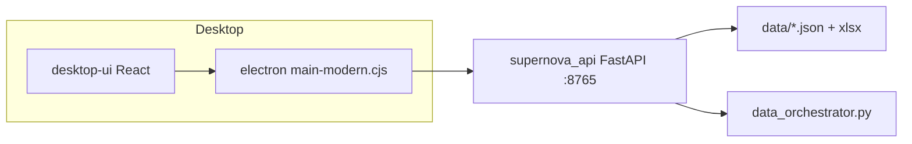

# Biotech Investment — Desktop (Node + Electron)

App desktop già impostata in questo repo: **non riscrivere da zero**. Stack:

| Parte | Cartella | Ruolo |
|--------|----------|--------|
| **UI** | `desktop-ui/` | React 18 + Vite + TypeScript + Tailwind |
| **Shell** | `electron/` | Electron avvia API Python e carica la UI |
| **API** | `supernova_api.py` | FastAPI su `127.0.0.1:8765` (orchestrator, fogli Excel, JSON) |

La UI **non** calcola predizioni in Node: legge `data/past_catalyst_predictions.json` e chiama `/api/*`.

---

## Prerequisiti (una volta)

Dalla root del progetto:

```powershell
python -m venv .venv
.\.venv\Scripts\pip install -r requirements-core.txt
.\.venv\Scripts\pip install -r requirements-electron.txt
```

Node (solo per UI + Electron):

```powershell
cd desktop-ui
npm install
cd ..\electron
npm install
```

Build UI per pacchetto Electron (base `./`, non `/`):

```powershell
cd desktop-ui
npm run build:electron
```

Output: `desktop-ui/dist/index.html` (+ asset in `dist/assets/`).

---

## Avvio rapido (produzione)

**Un solo doppio click / script** — API + finestra desktop:

```powershell
scripts\Avvia_Biotech_Desktop.bat
```

Oppure:

```powershell
cd electron
npx electron main-modern.cjs
```

Electron:

1. avvia `python -m supernova_api` (porta **8765**);
2. attende `/api/health`;
3. apre `desktop-ui/dist/index.html`.

---

## Sviluppo UI (hot reload)

**Due terminali:**

**Terminale 1 — API**

```powershell
.\.venv\Scripts\python.exe -m supernova_api
```

**Terminale 2 — Vite**

```powershell
cd desktop-ui
npm run dev
```

Apri http://127.0.0.1:5173 (proxy `/api` → `:8765`).

**Terminale 3 (opzionale) — Electron con DevTools**

```powershell
cd electron
set ELECTRON_DEV=1
npx electron main-modern.cjs
```

Oppure: `scripts\Avvia_Biotech_Desktop_Dev.bat` (avvia Electron; Vite va avviato a parte).

---

## Cosa fa l’app oggi

Schermate in `desktop-ui/src/App.tsx`:

- **Dashboard** — coorte da JSON + filtro ticker
- **Dettaglio ticker** — curve / metriche
- **Simulation / Accuracy / Financial** — griglia foglio Excel via API
- **Impostazioni** — token API, tema, log orchestrator, run orchestrator

API client: `desktop-ui/src/api/supernova.ts`.

---

## Dove continuare lo sviluppo

| Obiettivo | File / area |
|-----------|-------------|
| Nuova pagina / navigazione | `App.tsx`, `types.ts` |
| Chiamate backend | `supernova_api.py` + `supernova.ts` |
| Bridge sicuro Electron ↔ web | `electron/preload-modern.cjs`, `main-modern.cjs` |
| Stili / componenti | `desktop-ui/src/components/` |
| Dati locali in dev | `vite.config.ts` → middleware `/project-data` |

---

## Script utili

| Script | Uso |
|--------|-----|
| `scripts\Avvia_Biotech_Desktop.bat` | Build UI se manca + Electron |
| `scripts\Avvia_Biotech_Desktop_Dev.bat` | Electron + `ELECTRON_DEV=1` |
| `scripts\Avvia_Desktop_UI_Moderna.bat` | Solo Vite dev + API in finestra |
| `scripts\Avvia_SuperNova_Electron.bat` | Variante legacy Electron |
| `Start_Desktop_Launcher.bat` | Launcher alternativo (root) |

---

## Problemi comuni

| Sintomo | Fix |
|---------|-----|
| «UI mancante» | `cd desktop-ui` → `npm run build:electron` |
| «API non avviata» | `.venv` + `pip install -r requirements-electron.txt` |
| Pagina bianca in Electron prod | Ricompila con `build:electron` (non `npm run build` senza mode electron) |
| CORS / fetch API | API deve essere su `:8765`; in dev usa proxy Vite |

Token opzionale: file `.supernova_api_token` o env `SUPERNOVA_API_TOKEN` (per POST orchestrator).

---

## Architettura (schema)



Legacy (non Electron): `supernova_dpg.py` / Tk — separato dalla UI moderna.
