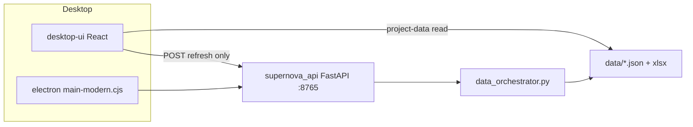

# SuperNova — Desktop (Node + Electron)

App desktop già impostata in questo repo: **non riscrivere da zero**. Stack:

| Parte | Cartella | Ruolo |
|--------|----------|--------|
| **UI** | `desktop-ui/` | React 18 + Vite + TypeScript + Tailwind |
| **Shell** | `electron/` | Electron avvia API Python e carica la UI |
| **API** | `supernova_api.py` | FastAPI su `127.0.0.1:8765` (orchestrator, fogli Excel, JSON) |

La UI **non** calcola predizioni in Node.

**Dati stabili (consigliato):** Electron legge file in `data/` via protocollo `project-data://` (snapshot JSON). L’API Python serve **solo** per refresh/orchestrator, non per le griglie Simulation/Accuracy/Financial.

| File snapshot | Foglio |
|---------------|--------|
| `data/simulation_sheet_snapshot.json` | Simulation |
| `data/accuracy_sheet_snapshot.json` | Accuracy |
| `data/financial_sheet_snapshot.json` | Financial |
| `data/past_catalyst_predictions.json` | Dashboard catalyst |
| `data/desktop_data_manifest.json` | Timestamp ultimo export |

Dopo ogni orchestrator/refresh, gli snapshot si rigenerano automaticamente (`save_final_outputs`). Manuale: `scripts\Export_Desktop_Snapshots.bat`.

---

## Prerequisiti (una volta)

Dalla root del progetto:

```powershell
python -m venv .venv
.\.venv\Scripts\pip install -r requirements-core.txt
.\.venv\Scripts\pip install -r requirements-electron.txt
```

Node (solo per UI + Electron):

```powershell
cd desktop-ui
npm install
cd ..\electron
npm install
```

Build UI per pacchetto Electron (base `./`, non `/`):

```powershell
cd desktop-ui
npm run build:electron
```

Output: `desktop-ui/dist/index.html` (+ asset in `dist/assets/`).

---

## Avvio rapido (produzione)

**Un solo doppio click / script** — API + finestra desktop:

```powershell
scripts\Avvia_Biotech_Desktop.bat
```

Oppure:

```powershell
cd electron
npx electron main-modern.cjs
```

Electron:

1. avvia `python -m supernova_api` (porta **8765**);
2. attende `/api/health`;
3. apre `desktop-ui/dist/index.html`.

---

## Sviluppo UI (hot reload)

**Due terminali:**

**Terminale 1 — API**

```powershell
.\.venv\Scripts\python.exe -m supernova_api
```

**Terminale 2 — Vite**

```powershell
cd desktop-ui
npm run dev
```

Apri http://127.0.0.1:5173 (proxy `/api` → `:8765`). In dev le griglie usano comunque gli snapshot in `data/`; senza snapshot esegui `scripts\Export_Desktop_Snapshots.bat`.

**Per uso quotidiano stabile** preferisci `scripts\Avvia_Biotech_Desktop.bat` (Electron + `project-data://`), non il browser su :5173.

**Terminale 3 (opzionale) — Electron con DevTools**

```powershell
cd electron
set ELECTRON_DEV=1
npx electron main-modern.cjs
```

Oppure: `scripts\Avvia_Biotech_Desktop_Dev.bat` (avvia Electron; Vite va avviato a parte).

---

## Desktop Web (Option B — server + browser)

Un solo processo Python serve **UI React**, **API** e **snapshot JSON** (`/project-data/`). Ideale su VPS/PC sempre acceso: refresh automatici lato server, browser si aggiorna da solo (poll manifest ogni 60 s).

**Build + avvio (Windows):**

```powershell
scripts\build_desktop_web.ps1
scripts\Avvia_Desktop_Web.ps1
```

Apri **http://127.0.0.1:8765/** (stesso origin: niente CORS, niente Electron).

**Profilo env:** `config/profiles/desktop_web_host.env`

| Variabile | Effetto |
|-----------|---------|
| `SUPERNOVA_SERVE_DESKTOP=1` | Monta `desktop-ui/dist` su `/` |
| `SUPERNOVA_BIND_ALL=1` | Ascolta su `0.0.0.0` (accesso LAN/VPS) |
| `SUPERNOVA_API_TOKEN=…` | Obbligatorio in produzione per POST refresh |
| `SUPERNOVA_SCHEDULE_TIMEZONE=Europe/Rome` | Fuso orario scheduler (CET/CEST) |
| `SUPERNOVA_HOURLY_FINANCIAL=1` | Lun–Ven **15:30–22:00**: quote Yahoo + Financial + live signals |
| `SUPERNOVA_HOURLY_FINANCIAL_START=15:30` | Inizio finestra oraria refresh finanziario |
| `SUPERNOVA_HOURLY_FINANCIAL_END=22:00` | Fine finestra (esclusa) |
| `SUPERNOVA_MORNING_REFRESH=1` | Lun–Ven **07:00**: CD (CT.gov) + IPO biotech + Simulation (+ sync SDS nuovi entranti) |
| `SUPERNOVA_MORNING_REFRESH_TIME=07:00` | Ora refresh mattutino |
| `SUPERNOVA_SDS_REFRESH=1` | Lun–Ven **09:00**: ricalcolo completo coorte SDS Supernova |
| `SUPERNOVA_SDS_REFRESH_TIME=09:00` | Ora refresh SDS giornaliero |
| `SUPERNOVA_MODEL_LAB_REFRESH=1` | Lun–Ven **16:30**: RA Prediction Calibration + SDS Accuracy + EIS Signal Impact |
| `SUPERNOVA_MODEL_LAB_REFRESH_TIME=16:30` | Ora refresh Model Lab (RA / SDS / EIS magnitude) |
| `SUPERNOVA_SATURDAY_WEEKLY_FULL=1` | Sab **07:00–14:00**: orchestrator WeeklyFull (SEC K-8 + enrich, app chiusa ok) |
| `SUPERNOVA_SATURDAY_WEEKLY_FULL_TIME=07:00` | Inizio finestra sabato |
| `SUPERNOVA_SATURDAY_WEEKLY_FULL_END=14:00` | Fine finestra sabato (esclusa) |
| `SUPERNOVA_SCHEDULED_REFRESH_MINUTES=0` | Legacy: live signals ogni N min (disattivato se hourly financial on) |
| `SUPERNOVA_DAILY_REFRESH_HOUR=-1` | Legacy: fast refresh giornaliero alle HH:00 (-1 = off) |

**Refresh manuali per tab:** restano i pulsanti Refresh in ogni pagina (Simulation, Financial, CD scan, ecc.) — calcoli specifici per tab, indipendenti dallo scheduler server.

**Log scheduler:** `data/logs/hourly_financial_YYYYMMDD.log`, `data/logs/morning_research_YYYYMMDD.log`, `data/logs/sds_cohort_YYYYMMDD.log`, `data/logs/saturday_weekly_full_YYYYMMDD.log`.

**Refresh automatico UI:** quando il manifest cambia, l’app ricarica tutti i fogli (senza click Reload). In modalità web il poll è ogni **60 s**; Electron resta a 20 s.

**Weekly full server:** con `SUPERNOVA_SATURDAY_WEEKLY_FULL=1` lo scheduler VPS lancia `scripts/saturday_weekly_full_refresh.py` ogni sabato (default 07:00–14:00 Rome). Su Windows: `Setup_Weekly_Saturday_Full.ps1`.

**Dev equivalente:** Terminale 1 `python -m supernova_api` con `SUPERNOVA_SERVE_DESKTOP=1`; build web + apri `:8765` (non serve Vite se usi dist servita dall’API).

---

## Cosa fa l’app oggi

Schermate in `desktop-ui/src/App.tsx`:

- **Dashboard** — coorte da JSON + filtro ticker
- **Dettaglio ticker** — curve / metriche
- **Simulation / Accuracy / Financial** — griglia da snapshot JSON locali (`data/*_sheet_snapshot.json`)
- **Impostazioni** — token API, tema, log orchestrator, run orchestrator

API client: `desktop-ui/src/api/supernova.ts`.

---

## Dove continuare lo sviluppo

| Obiettivo | File / area |
|-----------|-------------|
| Nuova pagina / navigazione | `App.tsx`, `types.ts` |
| Chiamate backend | `supernova_api.py` + `supernova.ts` |
| Bridge sicuro Electron ↔ web | `electron/preload-modern.cjs`, `main-modern.cjs` |
| Stili / componenti | `desktop-ui/src/components/` |
| Dati locali in dev | `vite.config.ts` → middleware `/project-data` |

---

## Script utili

| Script | Uso |
|--------|-----|
| `scripts\Avvia_Biotech_Desktop.bat` | Build UI se manca + Electron |
| `scripts\Avvia_Biotech_Desktop_Dev.bat` | Electron + `ELECTRON_DEV=1` |
| `scripts\Avvia_Desktop_UI_Moderna.bat` | Solo Vite dev + API in finestra |
| `scripts\Avvia_SuperNova_Electron.bat` | Variante legacy Electron |
| `Start_Desktop_Launcher.bat` | Alias → `scripts\Avvia_Biotech_Desktop.bat` (Electron) |

---

## Refresh domenica full (automatico)

**Default in app:** al **primo avvio del sabato mattina** (06:00–13:59, ora locale), con API attiva, parte l’orchestrator **WeeklyFull** (profilo `sunday`). Durante l’esecuzione compare il badge con **orologio antico** 🕰️; al termine un **popup** riporta esito, messaggio e durata totale. Una sola esecuzione per sabato (`localStorage`).

**Alternativa senza app aperta:**

* **VPS / server web** (consigliato): `SUPERNOVA_SATURDAY_WEEKLY_FULL=1` in `config/profiles/desktop_web_host.env` — lo scheduler in `supernova_api` esegue `scripts/saturday_weekly_full_refresh.py` ogni sabato anche senza browser.
* **Windows Task Scheduler (sabato):**

```powershell
powershell -ExecutionPolicy Bypass -File scripts\Setup_Weekly_Saturday_Full.ps1
```

* **Windows Task Scheduler (domenica, legacy):**

```powershell
powershell -ExecutionPolicy Bypass -File scripts\Setup_Weekly_Sunday_Full.ps1
```

Dettagli profili: `scripts\README_REFRESH_PROFILES.md`.

---

## Problemi comuni

| Sintomo | Fix |
|---------|-----|
| «UI mancante» | `cd desktop-ui` → `npm run build:electron` |
| «API non avviata» | `.venv` + `pip install -r requirements-electron.txt` |
| Pagina bianca in Electron prod | Ricompila con `build:electron` (non `npm run build` senza mode electron) |
| CORS / fetch API | API deve essere su `:8765`; in dev usa proxy Vite |
| `cache_util_win` / `Unable to move the cache` (0x5) | Chiudi tutte le finestre SuperNova/Electron; cache in `%LOCALAPPDATA%\SuperNova` (non OneDrive). Se persiste: elimina `%LOCALAPPDATA%\SuperNova\DiskCache` e `GPUCache`, riavvia. Evita di tenere il repo solo su OneDrive se i file in `data/` sono bloccati. |

Token opzionale: file `.supernova_api_token` o env `SUPERNOVA_API_TOKEN` (per POST orchestrator).

---

## Architettura (schema)



Legacy (non Electron): `supernova_dpg.py` / Tk — separato dalla UI moderna.
