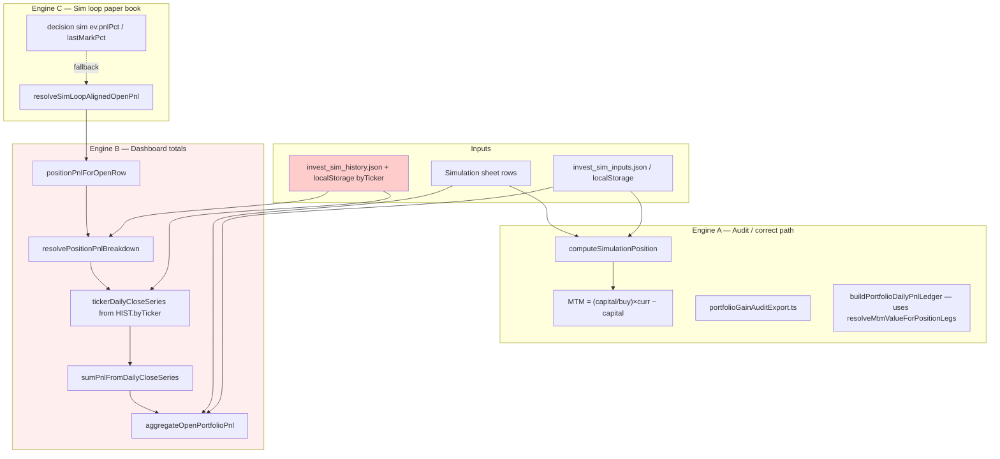

# P&L Bug Audit Report — SuperNova Desktop

**Date:** 2026-06-23  
**Status:** OPEN — fixes applied in source do **not** resolve production UI  
**Audience:** Cursor / next debugging agent  
**Severity:** P0 — dashboard totals wrong by ~10–60× vs audit export

---

## 1. Executive summary

The user sees **inflated P&L** on Portfolio pulse, Piggy Bank, Sim loop, and Synth (~+€48k total, RYTM +178%, NRIX +65%) while the **Excel audit export** (`supernova-gain-audit_*.xls`) shows realistic gains (~+3–10% per ticker).

**Root cause (confirmed by internal repro):**  
`invest_sim_history` snapshots in `byTicker` were **persistently contaminated** (saved from pre-fix `computeSimulationPosition` / `pos.valueNow`). The dashboard engine `resolvePositionPnlBreakdown()` **sums daily legs from those snapshots**. A partial fix (`historyCloseSeriesLooksContaminated`) only corrects **today's MTM value**, not **prior daily legs**. With **≥2 history snapshots** (typical in prod: hourly saves + disk merge), totals explode even when `computeSimulationPosition()` returns the correct price-based MTM (~+5%).

**Why existing unit tests pass but UI fails:**  
Tests use **single** contaminated snapshot; production has **clean → contaminated** chains. First-snapshot seeding masks the bug with one point only.

**Repro output** (`npx tsx desktop-ui/scripts/diag-pnl-audit.ts`):

| Scenario | `computeSimulationPosition` | Dashboard `aggregateOpenPortfolioPnl` |
|----------|----------------------------|----------------------------------------|
| No history | +€625 (+5%) | +€625 (+5%) ✓ |
| **1** contaminated snap | +€625 (+5%) | +€55 (+0.4%) — under-reports (seeding quirk) |
| **Clean + contaminated** (prod-like) | +€625 (+5%) | **+€21,636 (+173%)** ✗ |

This matches the user's RYTM +178% screenshot.

---

## 2. Observed symptoms (user)

| Surface | Expected | Observed |
|---------|----------|----------|
| Portfolio pulse KPI "Gain open (MTM)" | ~€2–3k | ~€48k |
| Per-ticker P&L TOTAL (RYTM) | ~+5% | +178% |
| Per-ticker P&L TOTAL (NRIX) | ~+3–4% | +65% |
| Sim loop / Synth OPEN POSITIONS | Same % as portfolio (€ scaled) | Same inflated % |
| Audit Excel export | Correct (shares × price − capital) | Correct ✓ |
| "Since your last visit" delta | Small | Inflated (reads visit snapshot + live contaminated totals) |

User portfolio inputs (from `data/invest_sim_inputs.json`, keys `TICKER|YYYY-MM-DD`):

| Key | buyPrice | capital |
|-----|----------|---------|
| RYTM\|2026-09-15 | 90 | 12,500 |
| NRIX\|2026-08-31 | 17.73 | 12,500 |
| KURA\|2026-09-30 | 9.8 | 10,606 |
| PTCT\|2026-09-30 | 78.42 | 7,697 |
| GPCR\|2026-08-26 | 45.73 | 3,499 |
| MLTX\|2026-09-28 | 18.51 | 5 |

Excel sheet columns `P&L (%)` and `Valore Attuale ($)` are **stale / model-driven** and must not drive live MTM when user buy is known.

---

## 3. Architecture — two P&L engines



**Correct formula (audit legend):**

```
shares = capital_eur / buy_price_usd
value_eur = shares × current_price_usd
cumulative_pnl_eur = value_eur − capital_eur
```

**Dashboard formula when `priorCloseCount > 0`:**

```
priorLeg = Σ (snap[i].value − snap[i−1].value)  from HIST.byTicker
todayLeg = Var.Giorn.% applied to MTM (or close delta)
total = priorLeg + todayLeg
```

If any `snap[i].value` was saved from contaminated `pos.valueNow`, **priorLeg is permanently wrong**.

---

## 4. Data flow — where numbers appear

| UI component | File | Function | P&L source |
|--------------|------|----------|------------|
| Piggy Bank bar | `MainDashboardView.tsx` | `aggregateOpenPortfolioPnl` | Engine B |
| Portfolio pulse KPI | `dashboardPulseView.ts` | same | Engine B |
| Pulse table P&L TOTAL | `DashboardPulseTable.tsx` | `chip.pnlEur` from chips | Engine B |
| Gain vs plan chart | `dashboardPulseAggregate.ts` | `actualFromHistoryPoint` → `byTicker` sum | **Contaminated HIST** |
| Simulation → P&L tab | `InvestmentSimulationView.tsx` | `positionPnlForOpenRow` | Engine B |
| History snapshots (writer) | `InvestmentSimulationView.tsx` | `portfolioSnapshot()` | Was `pos.valueNow` → **fixed** to `positionPnlForOpenRow` |
| Audit Excel | `portfolioGainAuditExport.ts` | ledger `totalEur + capital` | Engine A (aligned) |
| Sim loop rows/totals | `simLoopPulseView.ts` | `resolveSimLoopAlignedOpenPnl` → Engine B | Inherits HIST bug |
| Sim loop chart history | `buildSimLoopHistoryFromTicks` | paper marks | Engine C (still wrong historically) |
| Visit delta | `loadDashboardVisitSnapshot` | prior tickers vs live totals | Both can be contaminated |

---

## 5. Root cause chain (detailed)

### 5.1 Original contamination source

Before fixes, `portfolioSnapshot()` in `InvestmentSimulationView.tsx` wrote:

```ts
byTicker[key] = { value: pos.valueNow, pnl: pos.pnlEur, pnlPct: pos.pnlPct }
```

where `pos` came from `computeSimulationPosition()` after `reconcileAnchoredBuyMarkToMarket()` inferred buy from stale Excel `P&L (%)` / `Valore Attuale ($)`.

**Fix applied:** snapshot now uses `positionPnlForOpenRow()` — **future** snapshots heal, **past** snapshots remain bad.

### 5.2 Partial decontamination (insufficient)

`historyCloseSeriesLooksContaminated()` in `simulationPosition.ts` (~L253):

- Compares last history close vs price-based MTM
- If divergent → `resolveMtmValueForPositionLegs` returns `priceMtm` instead of history closes **for today only**

**Gap:** `tickerDailyCloseSeries()` still feeds **all** prior snapshots into `buildPositionDailyPnlLegs()` / `sumPnlFromDailyCloseSeries()`. Contaminated intermediate deltas are summed.

### 5.3 First-snapshot seeding masks single-snap tests

`buildPositionDailyPnlLegs()` (~L994):

```ts
if (!seededFromFirstSnap && investDayKey && pt.dayKey > investDayKey) {
  prev = pt.value;  // first snap becomes baseline, NO leg added
  continue;
}
```

With **one** contaminated snapshot: `priorLeg = 0`, total ≈ today only → test passes with small number.  
With **clean then contaminated**: leg1 = +€669, leg2 = +€21,581 → **+€22,250 priorLeg** → dashboard +173%.

### 5.4 History persistence amplifies

`hydrateInvestSimHistory()` merges:

1. `localStorage` key `supernova_invest_sim_history`
2. API / `data/invest_sim_history.json` on disk

Bad snapshots **survive rebuilds** and **re-sync to disk** via `flushInvestSimHistoryToDisk`.

### 5.5 Sim loop coupling

`resolveSimLoopAlignedOpenPnl()` calls `positionPnlForOpenRow()` → same Engine B → **same inflated totals** (scaled to €5k/synth cap).

Paper marks (`lastMarkPct`) still used for:

- `buildSimLoopGainPlanRowFromPaper` (chart row metadata)
- `buildSimLoopHistoryFromTicks` (historical chart)
- `buildSimLoopEqualSynthReconcile` (diagnostics)

---

## 6. Fixes already attempted (insufficient)

| Change | File | Effect | Why insufficient |
|--------|------|--------|------------------|
| Skip `reconcileAnchoredBuyMarkToMarket` when `entryBuy > 0` | `simulationPosition.ts` | `computeSimulationPosition` correct | Dashboard uses history legs, not raw MTM |
| `resolvePortfolioEntryBuyUsd` / trusted buy | `simulationPosition.ts` | Correct buy for MTM | Same |
| `historyCloseSeriesLooksContaminated` | `simulationPosition.ts` | Fixes today's `mtmValue` only | Prior legs still summed from bad snaps |
| `portfolioSnapshot` → `positionPnlForOpenRow` | `InvestmentSimulationView.tsx` | Stops **new** contamination | Old snaps remain |
| `resolveSimLoopAlignedOpenPnl` | `simLoopPulseView.ts` | Routes sim loop through Engine B | Engine B still broken with multi-snap |
| `sanitizePulseHistory` | `dashboardPulseAggregate.ts` | Drops outlier snaps vs live | Tolerance too loose; doesn't fix leg sum |
| Audit `liveValue = ledger total + capital` | `portfolioGainAuditExport.ts` | Export matches ledger | Export OK; dashboard not |

---

## 7. Test coverage gaps

**Existing tests pass (34 in simLoop + reconcile)** but miss production shape:

| Test | Scenario | Blind spot |
|------|----------|------------|
| `ignores contaminated history snapshots when entry buy is known` | **1** bad snapshot | Multi-snap chain |
| `uses portfolio audit-aligned P&L instead of inflated paper mark` | Clean history snap | — |
| All reconcile tests | 0–1 history points | Hourly prod history |

**Required failing test (reproduces user bug):**

```ts
// simulationPnlReconcile.test.ts — ADD THIS
it("ignores contaminated history when clean snapshot preceded bad save", () => {
  const history = [
    { ts: "2026-06-15T16:00:00Z", byTicker: { [key]: { value: 13169, pnl: 669, pnlPct: 5.35 } }, ... },
    { ts: "2026-06-17T16:00:00Z", byTicker: { [key]: { value: 34750, pnl: 22250, pnlPct: 178 } }, ... },
  ];
  const totals = aggregateOpenPortfolioPnl(simTable, inputs, history);
  expect(totals.pnlEur).toBeLessThan(800);  // currently FAILS with ~21636
});
```

Run diagnostic: `cd desktop-ui && npx tsx scripts/diag-pnl-audit.ts`

---

## 8. Recommended fix (prioritized)

### P0 — Engine B must not sum contaminated legs

**Option A (preferred):** In `resolvePositionPnlBreakdown`, when `historyCloseSeriesLooksContaminated(...)` is true **OR** `resolvePortfolioEntryBuyUsd > 0`:

```ts
// Treat as no reliable prior closes — use price MTM total
if (contaminated || trustedEntryBuy) {
  totalEur = roundEur(mtmValue - entryValue);
  priorLegEur = hasToday ? roundEur(totalEur - summed.pnlEurToday) : 0;
}
```

**Option B:** Sanitize at load in `mergeInvestSimHistoryPoints` / `hydrateInvestSimHistory`:

- For each `byTicker[key]`, recompute `{value, pnl, pnlPct}` from `(inputs[key].buyPrice, inputs[key].capital, simRow curr)` 
- Drop snaps where `|snap.pnlPct − pricePct| > 12` and trusted buy exists

**Option C:** One-time migration script rewriting `data/invest_sim_history.json` + instruct user to clear `localStorage` key `supernova_invest_sim_history`.

### P1 — Chart / visit snapshot

- `dashboardPulseAggregate.actualFromHistoryPoint`: prefer live `row.pnlEur` over `byTicker` when contamination detected
- Reset `dashboard.visit.snapshot` in localStorage after migration

### P2 — Sim loop

- `buildSimLoopHistoryFromTicks`: rebuild from aligned P&L when `inputs` available
- Remove paper-mark fallback in `buildSimLoopEqualSynthReconcile`

### P3 — Ongoing

- Hourly snapshot should store **audit-aligned** values only (already fixed in writer — verify deployed build)
- Add CI test for multi-snap contaminated history

---

## 9. Verification checklist (post-fix)

1. `npx tsx desktop-ui/scripts/diag-pnl-audit.ts` → all scenarios show dashboard ≈ +€625 for RYTM
2. Add multi-snap unit test → green
3. Browser DevTools:
   ```js
   JSON.parse(localStorage.getItem('supernova_invest_sim_history'))
     .slice(-3).map(h => ({ ts: h.ts, pnl: h.pnl, byTicker: h.byTicker }));
   ```
   → `byTicker` pnlPct should match price MTM, not Excel `P&L (%)`
4. Dashboard: Piggy Bank total ~€2–3k not ~€48k
5. Audit export vs pulse KPI: same order of magnitude per ticker
6. Hard refresh / rebuild: `cd desktop-ui && npm run build`

---

## 10. Key files

| Path | Role |
|------|------|
| `desktop-ui/src/sheet/simulationPosition.ts` | **Core P&L engine** — `computeSimulationPosition`, `resolvePositionPnlBreakdown`, `aggregateOpenPortfolioPnl`, `historyCloseSeriesLooksContaminated` |
| `desktop-ui/src/sheet/investSimStorage.ts` | History load/merge/persist |
| `desktop-ui/src/components/InvestmentSimulationView.tsx` | `portfolioSnapshot()` writer |
| `desktop-ui/src/sheet/dashboardPulseAggregate.ts` | Chart actuals from history |
| `desktop-ui/src/sheet/simLoopPulseView.ts` | Sim loop aligned P&L |
| `desktop-ui/src/sheet/portfolioGainAuditExport.ts` | Audit export (reference correct path) |
| `desktop-ui/scripts/diag-pnl-audit.ts` | Internal repro script |
| `data/invest_sim_history.json` | Disk-persisted contaminated snapshots |
| `data/invest_sim_inputs.json` | User buy/capital (trusted) |

---

## 11. Secondary issues (not primary P&L bug)

- **GPCR $32 close on 22/06** — data quality / bad price tick in sheet
- **MLTX €5 capital** — micro-capital distorts % displays (Risk & Benefit heart)
- **Build not deployed** — user may run old VPS/Electron bundle; verify after code fix
- **Excel columns** — `P&L (%)` / `Valore Attuale ($)` stale at source (orchestrator/export); UI must never trust them when portfolio active

---

## 12. Prompt for next Cursor session

Copy-paste:

```
Fix P0 P&L bug documented in PNL_BUG_AUDIT_REPORT.md.

Repro: cd desktop-ui && npx tsx scripts/diag-pnl-audit.ts
"clean then contaminated" shows aggregateOpenPortfolioPnl +€21,636 instead of ~€625 for RYTM.

Cause: resolvePositionPnlBreakdown sums prior legs from contaminated invest_sim_history.byTicker 
while historyCloseSeriesLooksContaminated only fixes today's mtmValue.

Implement Option A: when history is contaminated OR trusted entry buy exists, 
dashboard total must use price MTM (mtmValue - capital), not sum of history legs.

Add failing test from report §7. Optionally sanitize history on hydrate (Option B).

Do not change audit export path. Run vitest simulationPnlReconcile + simLoopPulseView.
```

---

*Generated by internal audit — 2026-06-23*
